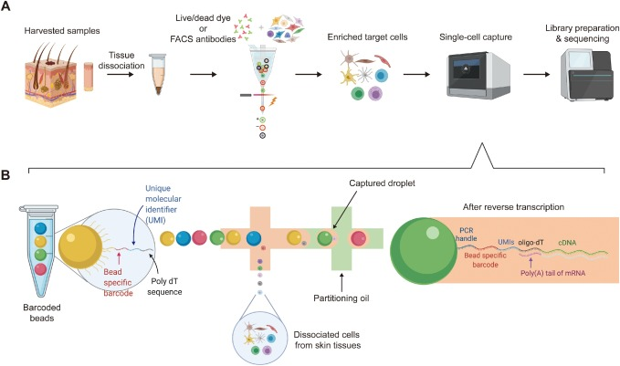

# Single-cell анализ
РНК секвенирование &mdash; это группа методов для количественного анализа
количества РНК в образце. Причина, по котороый мы хотим оценить количество РНК, заключается в том,
что разные клетки, и даже одна и та же клетка в разные моменты времени,могут экспрессировать разные гены, а
следовательно, выполнять различные функции. Типичное использование РНК секвенирования
заключается в том, чтобы оценить различие экспресси генов в двух группах, например, в клетках,
которые были подвержены действию лекарства, и в клетках, которые никто не трогал.
Например, у нас есть N образцов в одной группе, M образцов в другой группе, и мы хотим понять, какие гены
дифференциально экспресируются, то есть среднее значение экспрессии в группах различно. Другой пример
использования таких данных &mdash; это влияние определенных мутаций на уровень экспресси генов.
Для того, чтобы получить информацию об экспресси генов для каждой клетки по-отдельности применяются методы одноклеточного секвенирования.
Для каждой молекулы РНК, которую мы
отсеквенировали, мы сохраняли маленькую техническую последовательность, уникальную для каждой
клетки (баркод), а если к этому мы дополнительно будем сохранять уникальный идентификатор каждой
молекулы РНК, мы сможем получить правильное и полностью количественное представление
количества РНК в клетках. Таким образов, типичные данные, которые мы получаем после одного
эксперимента, &mdash; это большая таблица, где строки &mdash; это клетки, а столбцы &mdash; гены, и в ячейке $(i,j)$ содержится
число, которое показывает количество РНК гена j в клетке i.

## Как получают данные:

В зависимости от способа секвенирования мы можем получить два типа данных:
- количество разных типов генов
- множество наборов последовательностей 
Второй тип данных наиболее распространенный. После получения таких последовательностей мы отсекаем часть последовательности, которая отвечает за идентификацию клетки (бар-код). Оставшуюся последовательность мы накладываем на готовый геномный атлас, при помощи поиска подпоследовательностей в готовой последовательности и пр, т.е. картируем геном. Дальше подсчитываем количество совпадений у каждого, определенного при помощи картирования, гена. Так для каждой клетки для каждого гена определяется количество ридов (прочтений).

## Как выглядят данные:

- ~20,000 - 30,000 признаков
- высокая разреженность данных
- много пропущенных данных (дропаут)
- разный масштаб признаков

С данными такой высокой размерности почти невозможно работать из-за проклятия размерности. Например, в таком большом пространстве нам понадобится безумное количество клеток, чтобы покрыть все пространство признаков (Даже  если брать бинарную экспрессию). 

## Постановка задачи:

Типичный пайплан представляет из себя следующие шаги
 - Фильтрация семплов и признаков по установленным порогам
 - Нахождение вариабильных признаков (а значит, несущих информацию)
 - Понижение размерности с помощью линейных методов (PCA)
 - Дальнейший эмбединг в двумерное пространство с помощью tSNE или umap
 - Кластеризация
 
Дальше, в зависимости от задачи, можно искать ответы на многие вопросы. Например
 - Экспрессия каких генов является ключевой для кластеров?
 - Как связаны кластеры между собой? Обычно в случае, если мы смотрим на несколько временных точек для, допустим, одного пациента.
 - Какие кластеры представлены в одних условиях и отсутствуют в других?
 - Определение кластеров по маркерам и аннотация.

